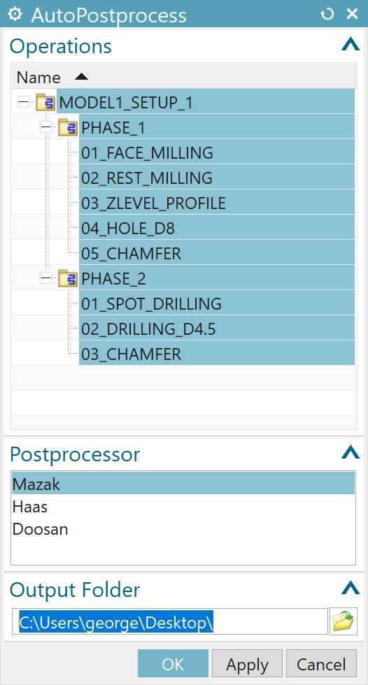

# AutoPostprocess-NX-CAM
A simple utility script to automatically generate G-Code files from an NX Manufacturing part.
I frequently had to manually export separate G-Code files for multiple CNC machines for every operation of a machined part as well as to take 2~3 screenshots of the part configuration for every setup. In order to avoid this clickfest, remain focused, and improve workflow flexibility when working on multiple CAM parts I wrote this simple script in Visual Basic with a GUI created with Block UI Styler.

## Usage

  

 1. Select operations for export in Operations section.
 2. Select the machines for which the operations will be exported.
 3. Specify the output folder.

By pressing OK/Apply a folder structure corresponding to the one in Program Order of the part is generated in the output path. In addition 3 screenshots (Iso, XY, XZ) are exported in every configuration folder. An example is shown in the following screenshot.

  

## Features
 - [x] Auto generation of all separate G-Code files for multiple machines (postporcessors).
 - [x] Auto generation of screenshots for each setup (MCS) in Geometry View.
 - [x] Auto generation of file structure according to Program Order.
 - [x] Smart detection of grouped operations: **Folders containing only operations and having only operations as siblings are exported as grouped operations** (can be verified in the Operations section before postprocesing). Useful for exporting grouped pattern instances of operations.
 - [x] Automatic renaming of the '1234' parent folder in Program Order according to file name.
 - [x] The aforementioned behaviour (postprocessors, screenshots) is fully configurable by inserting entries at specified places in the scirpt.

## Installation
 1. Keep the `AutoPostprocess.dlx` file in the `DLX\` directory, relative to the `AutoPostprocess.vb` file. 
    Or modify, if needed, in `AutoPostprocess.vb` the `theDlxFileName` (and `JournalFolder`) class variable inside the `OutputParameters` class constructor.
 2. Modify, if needed, the default output path by editing `AutoPostprocess.dlx` in Block UI Styler.
 3. Modify, if needed, the list of available machines by editing `AutoPostprocess.dlx` in Block UI Styler. Then, in `AutoPostprocess.vb` insert the info for theese machines by adding an `extension` and `PostProcessor` entry in each `machine` dict inside the `Utils` class constructor.
 4. Execute the script in an open NX Manufacturing part (this is necessary) by doing either of the following:
    * Run it as a journal 
      1. Developer tab (if hidden *right click* the tab bar and tick *Developer*)
      2. Play
      3. Browse...
      4. *Navigate and select* `AutoPostprocess.vb`
      5. Run
    * Create a UI button: 
      1. *Right click on an empty area in a* tab (eg. Home)
      2. Customize...
      3. *Naviagate to*: Commands tab/Categories section/My Items/My UserCommands
      4. *Drag a* User Command *from inside the* Items section *on the right to an empty space in a* tab. (don't press Close yet)
      5. *Right click the new button*
      6. Edit Action
      7. Browse...
      8. *navigate and select* `AutoPostprocess.vb`
      9. OK
      10. Close
